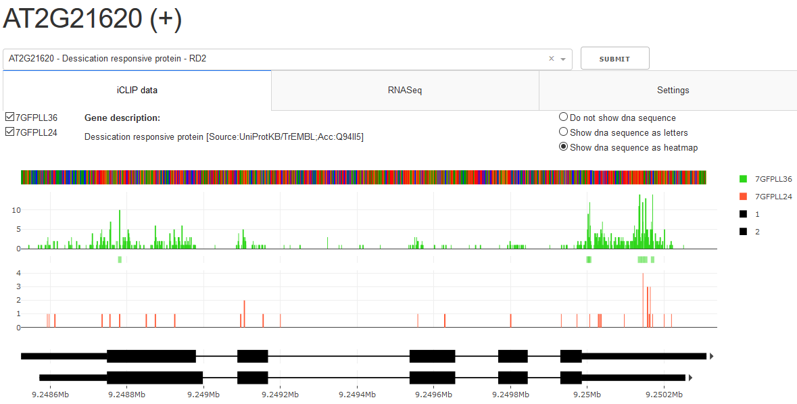

# SEQing [seeking]
Plotly Dash: interactive web-based tool for visualization of iCLIP-seq and RNA-seq data.

The goal of this project is to develop a generalized, web based, interactive visualisation and exploration tool for iCLP-seq and RNA-seq data. The application case is a local machine inside mounted in the users network, allowing members a web-based (browser) access to explore their experimental data omitting local installations. 

## Getting Started

These instructions will get you a copy of the project up and running on your local machine for development and testing purposes. See deployment for notes on how to deploy the project on a live system.

### Prerequisites

The file [requirenments.txt] (requirenments.txt) can be used to install all needed needed dependencies for the project. Python 3.5 or higher is requried, it is recommend you setup a virtual environment for this project.

Once you have setup your virtual environment run the following code to install the dependencies:
```
pip install -r requirenments.txt
```

### Installing

## Deployment

### Minimal startup

Once you have activated your virtual environment (env) you can perform a minimal startup of the tool with the following command:
```
python validator.py gene_annotation_file
```
Note that some_gene_annotation_file is either a BED12 or gtf file containing gene annotations for the organism of your choice. You can also provide mroe than one file. In this case multiple annotation tracks will be added. Please ensure that all files have the correct file extension and do NOT have a header line.

On successful initiation the dashboard is accessible via your browser. Genes can be selected from a dropdown on the top to display their associated gene models below.

### Adding iCLIP and binding site data

One of the key features of this tool is the interactive visualization of raw iCLIP data. This data should be passed in the form of 4 column bedgraph files. Example:
```
python validator.py gene_annotation_file -bsraw iCLIP_data_file_prefix
```
The program will automatically treat everything before the first underscore in the filename as a prefix. This prefix will be used to match a raw iCLIP file to a corresponding binding site file, if provided:
```
python validator.py some_gene_annotation_file -bsraw prefix_your_iCLIP_data_file -bsdata prefix_your_binding_site_data_file
```
These files must be 6 column BED files. The two files with the same prefix will be treated as one dataset the tool and their graphs will be grouped together. Please note that an iCLIP data set consists of maximal two files, it must have a raw iCLIP file and may have a binding site file. You can have multiple datasets, just pass multiple files to the command line options, seperated by spaces.

### Displaying descriptions and sequences

Apart from visualising iCLIP and binding site information the program can also show gene descriptions:
```
python validator.py some_gene_annotation_file -desc description_file
```
Here description_file should be a tab seperated csv file containing the following columns and header:
```
ensembl_gene_id	description	external_gene_name	gene_biotype
``` 
For this option the program only takes a single file.

You can also provide dna sequences in fasta format for visualisation:
```
python validator.py some_gene_annotation_file -seqs sequence_file
```
There are a few limitations:
* The fields in the desriptions of the fasta entries should either be seperated by a space or colon, with the first field being the gene name:
```
>ENST00000631435.1 cds chromosome:GRCh38:CHR_HSCHR7_2_CTG6:142847306:142847317:1 gene:ENSG00000282253.1 gene_biotype:TR_D_gene

>AT1G03993.1::Chr1:23311-24099
```
* Your sequences have to cover the whole region of the genes as defined in the gene annotations. The program will automatically construct a master sequence if mutliple isoforms of the gene are provided, but the individual isoform sequences have to be continuous.

### Colors

The current default color palette consists of four colors. Colors will be reused should more than four datasets be provided. You can provide your own colors usig a command similar to the following:
```
python validator.py some_gene_annotation_file -colors 'rgb(46, 214, 26)' 'rgb(255, 87, 51)'
```
You can provide how many colors you need, they will be associated to datasets based on the order they are provided.

### Sorting

Should you have multiple datasets you might want to take a look at the option to provide expressions for sorting. Graphs for datasets can be toggled on and off in the visualisation. Depending on the way the user does this, the order in which datasets are displayed may change. Therefore the graphs are sorted by default in ascending order using the prefix. However you might have a need for more complex sorting, like the following example:
```
python validator.py some_gene_annotation_file -bsraw 8pref26_iCLIP 8pref30_iCLIP -k 'lambda x : x[-2:]' 'True' -k 'lambda x : x[:1]' 'False'
```
Take note of the -k option. It allows you to provide arguments for the list.sort function of python. In this case we provide 2 different sets of arguments, the first sorts the prefixes by the last two characters, descending and the second sorts them by the first character, in ascending order. Each -k has to be followed by a string containing the desired lambda expression and a bool telling the program wether to revert the order(default is ascending).

### Advanced Description

Using the -adv_desc option you can provide additional information for the genes in your dataset which will be displayed in the "Details" tab. The option takes a single tab seperated file which needs to have a header line and a column named gene_ids. Another constraint is that the file should only contain one row of data per gene, thus multi value attributes such as synonyms need to be combined into one, semicolon delimited field. All other columns can have names of your choosing. Example:
```
gene_ids	synonyms
AT1G01010	ANAC001;NAC domain containing protein 1
```
As an additional feature it is possible to create subtables for complex attributes like publications. Say you have author, year and title information. In that case you can use additional comma based delimitations and the -sub_tables option to create a tabular view of your publication data. Example for the field in your advanced description file:
```
gene_ids	publications
AT1G10670	author1,year1,title1;author2,year2,title2
```
As you can see you can mix comma and semicolon delimitations for this. The -sub_tables option takes an additional file which is responsible for telling the dashboard that you want a table for the specific attribute. The structure is very simple, it is a tab delimited file cotaining 2 columns, one containing the attribute names you want subtables for and the other containing the semicolon delimited column headers for said table:
```
publications	Author;Year;Title
```
This file does not need a header line. Should the number of columns not match the number of comma seperated entries in your advanced description file the data will be displayed as the comma seperated string without a table.

Finally you can use ? before a value to mark it as a hyperlink:
```
gene_ids	ext_link
AT1G01010	?http://araport.org
```
This will also work for semicolon seperated values as well as in subtables, but not in comma seperated Strings.
### Screenshot


## Built With

## Contributions

## Versioning

## Authors

## License
MIT

## Acknowledgments

